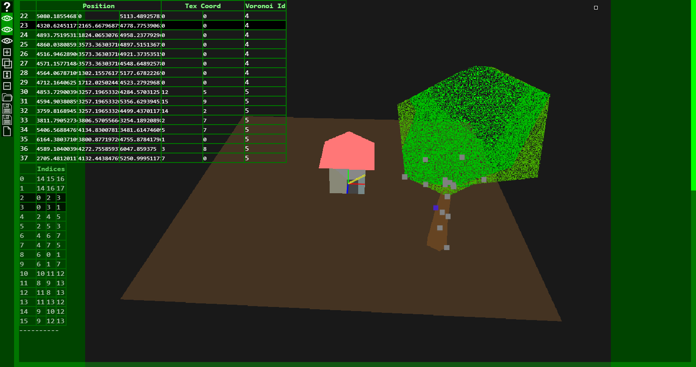

# Object-3D-View

  
Silakan kunjungi [Object 3D View](https://angkasamuhammad.github.io/Object-3D-View/object3dview.html)  
  
Membuat objek 3d berbasis web  
Belum support (e.g. OBJ, FBX, 3DS, PLY, STL, etc.)  
  
Aku latihan bikin 3d editor yang diharapkan bisa dijalankan di komputer kentang.  
3d object menggunaakan voronoi sebagai texture sehingga tidak pixelated saat dizoom.  
